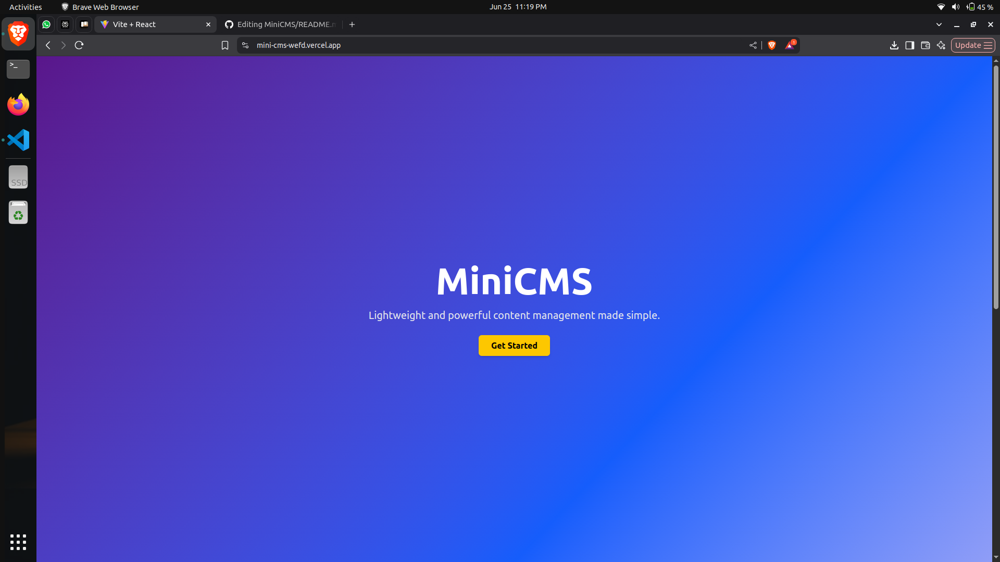

# MiniCMS - Admin Blog Panel

A lightweight **Content Management System (CMS)** built using **React + Firebase**, providing a clean and intuitive interface for managing blog posts and images. Authenticated users can create, update, delete, and preview blog content with full responsiveness and elegant UI design.

---

## 🌐 Live Demo

🔗 [View Deployed Project](https://mini-cms-wefd.vercel.app/)  
🔗 [GitHub Repository](https://github.com/Shravanis30/MiniCMS)

---

## 📸 Screenshots

### 🏠 Home Page with Recent Activity


### 📝 Create Blog Page


### 📋 View All Blogs


### 🖼️ View Uploaded Images


---

## ✨ Features

- 🔐 **Google Login** with Firebase Authentication
- 📝 **Create, Edit, and Delete** blog posts
- 📄 **Pagination** for browsing blogs
- 🔍 **Search & Filter** by title, tags, or content
- 🌄 **Image Upload with Preview**
- ☁️ **Image Hosting** via Cloudinary
- 👤 **Auto-filled Author Info** (Google Name & Profile Pic)
- 🕓 **Recent Activity Tracker**
- 📱 **Responsive UI** using Tailwind CSS
- 🧭 Sidebar navigation for all sections
- 🎨 Beautiful layout with dark/light blend and transparency blur

---

## 🛠️ Tech Stack

| Feature        | Technology                                |
|----------------|--------------------------------------------|
| Frontend       | React.js, Vite                            |
| Styling        | Tailwind CSS                              |
| Routing        | React Router v6                           |
| Auth           | Firebase Authentication (Google Login)    |
| Database       | Firebase Firestore                        |
| File Upload    | Cloudinary API                            |
| Icons          | React Icons                               |

---

## ⚙️ Getting Started

### 🔑 Prerequisites

- Node.js & npm installed
- Firebase Project with:
  - Authentication (Google Sign-In) enabled
  - Firestore Database enabled
- Cloudinary account with upload preset

---

### 📦 Installation Steps

```bash
# Clone the repo
git clone https://github.com/Shravanis30/MiniCMS.git
cd MiniCMS

# Install frontend dependencies
cd MiniCMS-Frontend
npm install

# Start the frontend
npm run dev

# Install backend 
cd ../MiniCMS-Backend
npm install
npm run dev
